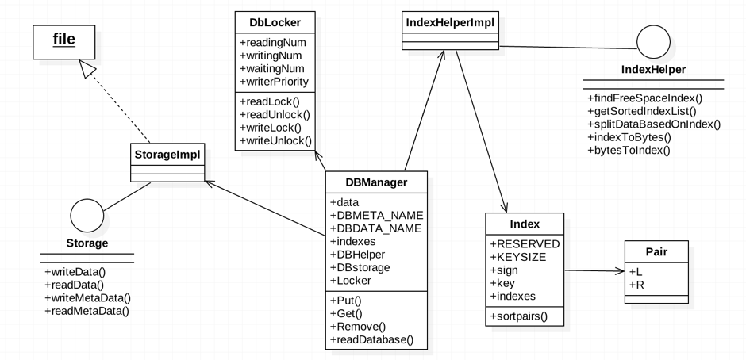
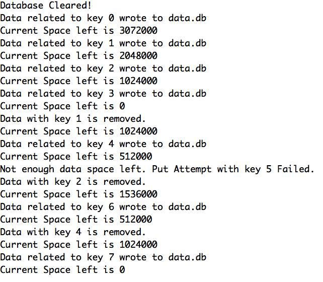
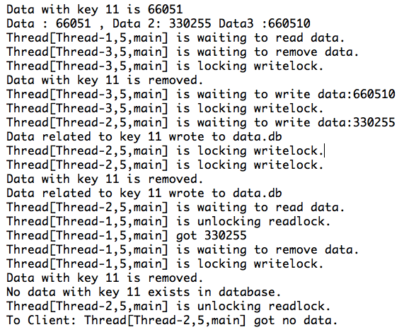
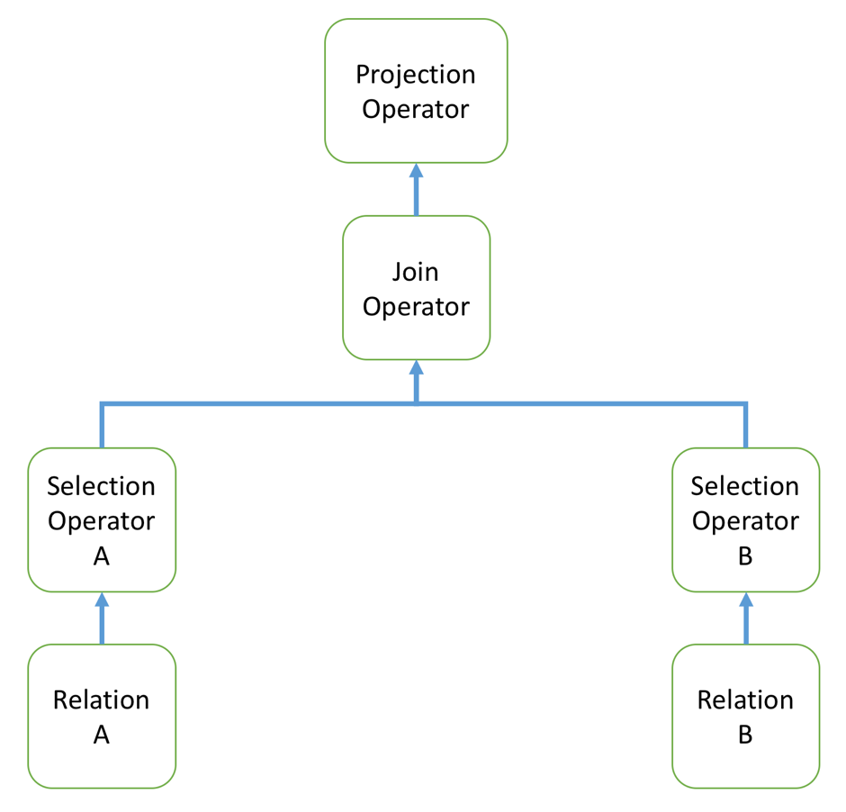

#DataBase internal programming project
###CS542-F15: database management system
--
#Contents	
**Project1**	
[**Framework**](#0)				
|------[Operating procedure](#9)		
|------[metadata structure](#11)			
|------[Physical data storage](#13) 
[Main classes](#1)		
|------[Storage](#2)		
|------[StorageImpl](#3)		
|------[Pair](#4)			
|------[Index](#5)			
|------[IndexHelper](#6)		
|------[IndexHelperImpl](#7)				
|------[DBManager](#8) 
|------[Dblocker](#17)		
[Validation](#10)		
|------[Fragment](#14)		
|------[Concurrency control](#15)
[Further Assumptions](#16)

**Project2**		
Table Metadata		
Attribute Index		
Relation&DBManager		
Condition			
Shell Validation		

**Project 3**		
AlgebraNode		
Parser		
Pipeline		

#Framework：
##Operating procedure
The data/metadata will be stored as byte array. *StorageImpl* class will be responsible for fetch/put the byte array, in which both data and metadata are stored, out of/into the file. IndexHelperImpl will help *DBManager* to transform metadata into what we desire, that is a hash table whose key and value are the key for record and *Index* class, respectively. The more query and update will be executed by the *DBManager* class.

The required functions--put, get and remove--are implemented within the *DBManager*. The *Index* will be modified after these operations. All these execution will happen in the main memory. Before the database is closed, all the *Index* in memory will be transformed back to byte array and then this array will be re-written into the disk.

##Metadata structure:
 
### Storage-Metadata
Assumptions & decisions:

1. The start sign is one-byte number, which is -1. There is no other numbers--key, offset or length--to be negative. Any negative indexes are forbidden.
2. Pair list in the class *Index* are sorted. Every times *indextobytes()* are called, the pair list in an index will be sorted by L's value.
3. All the metadata will be converted into byte array. In this case, integer will be convert into 4 byte numbers. In other word, the key, offset and length all will be converted into 4 byte numbers. 
4. There will be a three-byte reserved space for each record. They will be active when it's necessary in the future.

#### indexMap:		
This is a hash table: *Map\<K, V\>*. This structure will be used in the main memory.
*K* is *Integer*, and *V* is a class of *Index*. indexMap will include the metadata in our database, and more detail will be stored in the class *Index*.
    
1. K represents for the key of a record. K will be an int type number, which is 32-bit or 4 bytes.
2. V is class *Index*. The record will also be treated as the instance of Index class, which has the same attribute key as K. type: int

#### *Index* class:  
This class will contain metadata of a certain record, which key and index pairs.

1. key represents for the key of a record
2. index pairs is a list of class *Pair*. 

#### *Pair* class: 
Pair class,*Pair\<L,R\>*, contains start position(or offset in data array) and length. Typically, one record will have one pair, but when free space are not available in whole multiple indexes are introduced to arrange the data into fragmental space. 	
L is for array offset in data array, and R is for the length of the respective record(or the fragment of that record). Both L and R are int number, which is 4 bytes.

### *Table-Metadata*
Assumptions & decisions:
1. The start sign is one-byte number, which is -2. Still, there is no other numbers to be negative. 

##Data storage form
### Assumptions & decisions:
1. The data, whichever it is metadata or data itself, will be stored as byte array, which will be accessed by FileStream.
2. We store the data and metadata in two separated files, data.db and data.meta. The size of the data.db, which stores data, is constantly 4MB, while data.meta file could has a varied size.

#### byte array:		
Physical metadata storage form. The byte array will be transformed from indexMap when the data need to be stored into disk. Usually, every 16 bytes will be used for recording the metadata for each record, but this size will be varied because of fragment storage. The byte array's structure is shown as followed:
 	
|element|purpose|size|
|---|---|---|
|Start sign|identify record header|1 byte
|reserved bytes|reserved for unexpected situation|3 bytes|
|key|the key of the data|4 bytes
|*Pair* class|stored \<offset,length\> pairs|8*pair number bytes

Metadata of each record will be stored one by one all together.

|metadata 1|metadata 2|metadata ...|
|---|---|---|

Each metadata will have structure as followed:

|start_sign (1B)|reserved bytes (3B)|key (4B)|offset 1 (4B)|length 1 (4B)|offset 2 (4B)|length 2 (4B)|...
|---|---|---|---|---|---|---|---|---| 

# Main classes
####*Storage*
This is an interface, which contains 2 attributes and 4 method. Storage play a role of write and read data and metadata. By using FileStream, these method can load all the data/metadata, in the form of byte array, into the main memory.  Its two attributes, which are *DATA_SIZE* and *METADATA_SIZE*, are responsible for the constraint of maximum data/metadata size.
#####method:
|method name|description|
|---|---|
|void writeData ( String fileName, byte[] data)|write byte array into a file.
|byte[] readData ( String fileName)|read byte array from the file.
|void writeMetaData ( String fileName, byte[] metadata)|write byte array into a file.		
|byte[] readMetaData ( String fileName)|read byte array from the file.

####*StorageImpl*
The implement of interface Storage. The same method.
####*Pair*
A self-defined class. It is an offset-length pair for some record. The record can be stored into several pieces. There is always a pair mapping to one piece. *L* and *R* are two integer attributes, which are represented for start offset in data and the length of this piece of record, respectively.				

|attribute name|description|
|---|---|
|L|start offset in data byte array|
|R|length of this piece of the record|
####*Index*
*Index* is our main metadata structure in memory. Most of ours work are based on this class. An *Index* class has all the metadata for one single record.
#####Attribute:
|attribute name|description|
|---|---|
|private static final byte sign = -1|Header identifier. Pre-defined as -1, which can be distinguished with any other byte data.
|private static final byte KEYSIZE = Integer.BYTES|The size of the key. Since key is *int*, the size is 4 bytes.
|private static final byte RESERVED=3|3 reserved byte-size numbers for the unexpected usage.
|private int key|Key value of the record
|private List\< Pair\<Integer, Integer> > indexes|A list of Pair class. It can store all the offset-length pairs for single record.
#####Method:
|method name|description|
|---|---|
|void sortpairs()|Makes sure all the pairs within a record will be sorted. Used Bubble sort algorithm.

####*IndexHelper*
This is an interface. It includes the methods to manipulate the *Index* class in order to get query and update results.
#####Method:
|method name|description|
|---|---|
|List\<Pair\<Integer,Integer\>\> findFreeSpaceIndex(int size) | Return the current free space in form of pair list according to size of the data, which will be saved.
|List\<Map\<Integer,byte[ ]\>\> splitDataBasedOnIndex(byte[ ] data, List\<Integer\> indexes)|Taking the data and free space pairs, function will return the updated hashtable.
|byte[] indexToBytes(Map\<Integer, Index\> indexes)|Input: indexMap in the memory. Output: byte array for disk storage.
|Map\<Integer, Index\> bytesToIndex(byte[ ] metadata)|Input: byte array for disk storage. Output: indexMap in the memory.	
|Map\<Integer, List\<Index\>\> getIndexesBuffer()| Load the metadata into the memory.

####*IndexHelperImpl*
The implement of interface IndexHelper. The same method. This class has been designed in singleton pattern.
####*DBManager*
DBManager is designed to execute most of the database access work. A user must go through the manager to access the data. At the same time, it is in charge of disk storage, searching for index, concurrency control. This class has been designed in singleton pattern.
#####Attribute:
|attribute name|description|
|---|---|
|private int INDEX_USED = 0;| Count the number of used index.	
|private int DATA_USED = 0;	|	Count the size of used data.
|private byte[] data;		|  Storage data.
|private Hashtable<Integer, Index> indexes;| Metadata in hash table.
|DbLocker Locker| Call the DbLocker to realised concurrency control.
|Storage DBstorage| Call the Storage to complete disk storage.
|private IndexHelper DBHelper| call IndexHelper to execute query and update task.
		
#####Method:
|method name|description|
|---|---|
|void readDatabase()|Read the database and upload the data into memory
|void Put(int key, byte[] data)| put byte data with a key into database.
|byte[] Get(int key)|get the data with the key.
|void Remove(int key)|remove the data with the key.
####*DbLocker*
DbLocker will provide DBManger with a re-entrant ReadWrite lock so as to ensure concurrency control under the multiple processors situation.

#####Attribute:
|attribute name|description|
|---|---|
|Map readingThreads|Number of read accesses for currently reading threads
|int writeCount| Number of currently writing accesses of one thread
|int writeRequests| Number of writing requests
|Thread writingThread| Current writing thread

#####Method:
|method name|description|
|---|---|
|ReadLock()|Grant read access to the current thread.
|ReadUnlock()|Unlocks the ReadLock.
|writeLock()|Grant write access to the current thread.
|writeUnlock()|Unlocks the writeLock.
#Validation(P1)
##Fragment 

### To solve the fragment problem:

### **Pseudo code**
### (1) public List<Integer> getSortedIndexList()
Get the Index Buffer from DBManager   
Loop the indexes in the IndexBuffer Map to get the index pairs list:  
----Loop the index pairs list:  
--------Get the start-length index pair and change it to start-end index pair  
--------add the start-end index into a start-end list  
----Sort the start-end list  
----return the list in order to find free space method  

### (2) public List<Pair<Integer,Integer>> findFreeSpaceIndex(int size)
Loop the start-end list:  
----Get two start-end indexes once a time  
----The free space equals second index start - first index end  
----Compare the size of free space with that of the saving data:  
--------if size of free space >= saving size of saving data:  
------------add the (start, saving size) pair to free space list  
------------return free space list  
--------else:  
------------add the free space to free space list  
------------saving size = saving size - this free size  
------------next loop  

### (3) public void splitDataBasedOnIndex(byte[] data_to_save, List<Pair<Integer,Integer>> indexes)
Loop the free (start,end) pair in free space list:  
----Get the free length = end - start  
----copy the same length in saving data to the (start, end) in the database  
----next loop  

--
### Assumptions & decisions:

### Results

To validate our design, we conducted the following experiement. We first put 4 byte arrays with key 0,1,2,3 of size 1MB to the database. Then we removed key 1 and put 0.5 Mb for key 4. After that,  we put a 1 Mb data with key 5, which should result in a failure as there are not that much space left. Following that we removed key 2 and put 1 Mb with key 6 and a success is expected. Finally, we remove key 4 and wrote 1 Mb with key 7, and such attempt should be allowed. 

Below are the test run results from console.

As you can see, the put attempt with key 5 failed while key 6 and 7 succeeded.

##Concurrency control

### Assumptions & decisions:
1. Threads can only be read if no other threads have write accesses or in request of it.
2. Threads can write when no other threads are reading or writing the database.
3. When a thread is writing, it also has access to read.
4. Multiple read and write requests from a same thread is allowed.

#### Readlock:
A thread is granted read access to the database if : 

* It is the current writing thread. This is implemented by keeping track of the current writing thread.
* It has been granted read access already to ensure Read-Read Re-entrance. This is implemented by keeping a map called "readingThread" in the memory, where the key is the thread instance and the value is the count of read accesse.

Denied if :

* Other thread is writing. 
* There are threads waiting to write. This is implemented by counting the number of write requests.

The thread waits until such criterion is met. After that, it updates the readingThread Map and get data from the database. After query is complete, it updates the Map and notify other threads.

#### Writelock:
A thread with write requests first adds to the waitinglist. Then it is granted access to the database if :

* It is the only thread reading the data. (Auto Upgrade)
* No other thread is writing. 

Denied if :

* This thread is not the current writing thread.
* Has readers other than the current thread.

Just like the Readlock, the thread waits until such criterion is met. Then it increments the number of itself writing the data, decrement the waiting threads and set the current writing thread to itself so as to ensure later re-entrance. After writing the data, it decreases its current writing access to the database and updates the current writing thread attribute if needed. Finally, it notifies other threads.

### Result

To validate concurrency control over the database, we tried the following experiment: 

We wrote a class named Threadtest that can carry out a specific list of operations on the database according to the user's request. Then we instantiated several Threads of this and assigned different tasks to them. These tasks should be carried out in a sequence that follows our assumption and decisions of concurrency control.

There are three threads in our experiment, and named as Thread 1, 2 and 3. All threads are assigned the same key (key 11), but with different value. Thread 1's tasks are to read and remove; Thread 2's are to write and read; Thread 3 is scheduled to remove and write. Thread got 66051 , Thread 2 got 330255 and Thread 3 is 660510. For test purposes the key 11 is put with 66051 first.

Below are the test results:

From above we can see after all three threads hadstarted, the first task of Thread 1 and 3 are added, but Thread 3 locked the database first and removed key 11. Then Thread 2's first task and 3's second tasks are added while Thread 3 locked again and wrote its data to the database. Thread 2 then locked the writelock and updated the value mapped to key 11 (which is seen in above as remove first then put). After that, Thread 2's second task is added but Thread 1 locked the read lock first and got the data (which is Thread 2's pre-assigend value : 330255). Then Thread 1 removes the key 11 so when Thread 2 tries to read the data later, it got nothing.

---	
# Further Assumptions in Project 2

##Table-Metadata
We add a new type of metadata--table metadata--to store the table information so that multi-attribute based on project 1 can be implemented.	

###Assumptions:

1. Table metadata contains start sign, reserved bytes(3 bytes), table id, table name, attributes numbers, attribute names and lengths.
1. The start sign of table-metadata is one-byte number, which is -2. Still, there is no other numbers to be negative.
2. There are some reserved bytes, which could be used in an unexpected way and make flag searching efficient.
2. table id, is 4-byte integer and non-negative, so max table number is 2^31.
3. Table names will occupy 16 bytes, including 2-byte flags and max 14 table name length.
4. Attribute number is 4-byte integer and non-negative. 
5. Attribute names will occupy 16 bytes, including 2-byte flags and max 14 table name length.
6. Attribute type is 4 bytes and indicates the data type of the domain. We assumed 1 is int, and 0 is String.
4. Attribute length is 4-byte integer and non-negative. We also assumed that all the attributes have fixed length, so length may be pre-set.

#### Physical Structure
|start sign(1B)|reserved bytes(3B)|tab id(4B)|tab name(16B)|attribute 1(24B)|attribute 2(24B)|...
|---|---|---|---|---|---|---|---|---|
For each attribute:

|attribute name(16B)|attribute type(4B)|attribute length(4B)|
|---|---|---|
Every attribute/table name are divided into two parts, which are both 7 bytes.

|search flag(1B)|attribute/table name part 1(7B)|search flag(1B)|attribute/table name part 2(7B)|
|---|---|---|---|

#### Memory Structure
Table metadata:
> Map\<int tid, List\<Pair\> tableMeta\>
	
tableMetadata
> List\<Pair pairs\>

First pair in the list:
>Pair\<int tab\_id,String tab\_name\>

The rest of pairs:
>Pair\<String attribute\_name,Pair attribute\_info\_Pair\>

attribute\_info\_Pair\:
>Pair\<int attribute\_type, int attribute\_length\>

#### Table Metadata transformation
We add two more functions in IndexHelper to transform the physical metadata into memory, and from memory back to physical as well.

bytesToTabMeta()
Load table metadata from metadata byte array. This function needs to identify the correct metadata, which could be mixed with index metadata.
tabMateToBytes()
Return metadata array of table metadata, than when we write metadata into db file, this returned array will concat with index metadata.
##Relation And DbManager
For now, we assumed that we **only have one relation** in our database. We will add relation class in the future project. In other word, we don't have relation class now, and all the interface are under the class DBManager. We will finish this part in the next project.
##Attribute Index
Based on the project 1, we add three methods to realize the indexing mechanism with **Hash Table**. In the project 1, we have already realized clustered index, which is based on key, or rather rid. Now we need to construct unclustered index based on other attributes.
The AttrIndex is a genric class, which allows easy creation of indexes based on any types of attributes. The default constructor in AttrIndex takes in a List of Strings, where the elements are the to-be-indexed attribute name(s). The class then creates an index based on these attributes by concatenating each value. 
In the future, B+Tree-based-indexes will be added to allow fast searches on range.

#### put
This method has two inputs, the rID(keys from the clustered index) which is an integer, and the data value with generic type. Since we are indexing on attributes, the datavalue will be the key. The Hash Table inside AttrIndex will first check if there exists a value that equals to the input datavalue. If such is found, it implies the existence of duplication in this indexed attribute and the corresponding rID is added to a List of Integers under such data value. Otherwise, a new List of integer is generated with the input rID ,and is mapped with the data value from the hash table.
#### get
This method takes in the data value with generic type, and seeks the corresponding list of rIDs inside the Hash Table. If not found, null is return.
#### remove
This method removes the mapping from the given data value to its corresponding list of rIds.

We also add two methods, **hashtabToBytes()** and **bytesToHashtab()** to Indexhelper to transform index between memory and physical storage.

###Attribute Index structure 
Hashtable<\Integer, List<\Integer>>

##Condition
In order to validate the Index function, we consider to implement selection function based on the SQL where-condition. We have created a Condition class, which play a significant role in our query validation.
###main methods of condition 
**assertCondition()**		
Assert the conditions, transform string statement into string array and logic flags.	

**throwCondition()**		
Throw the condition values which are produced by assertCondition() method.

**handleCondition()**	
Handle the condition values returned by the throwCondition() and judge the condition is true of false.

**removeExtraSpace()**	
Remove the meaningless space in the string statement.

##Validation
Assumption:	

1. Since some attributes contain char ',', which is a separator for csv file, read data from csv file could be a problem. For simplicity, we use '@' as separator.
2. To store the data, we will convert the string into byte. We treat every character in String as ASCII code, so some uncommon char will be displayed as '?'. In other word, we did not handle the non-ASCII code character problem. 
2. We have implemented **SQL select statement** and **Create Index statement**, which is pretty closed to the real SELECT. Our SELECT can do PROJECT and SELECT job. SELECT function will be based on a new class Condition, which will convert a String statement into boolean value.
3. Our Condition class does not support bracket but support multiple logic and/or statement.

###validation instruction:
Here are our shell commends listed in the tables. Although some of them are validation in the first project including fragment storage and concurrency control. Although our SQL is simple, it contains most common usages, which are projection and equality selection. More functions and commands will provide in the next several projects.

In order to run the shell program, please run the DBTool.shell() function, or run the DBTool.main(). Type help will give you more help information.

|command|function|
|---|---|
|q or quit|quit the shell|
|show [<filename>]|	show the space of the database, default file is 'cs542.db'.|
|fragment or f|		validate fragment	|
|concurrency\c|		validate concurrency control
|clear or cl	|		clear the database	
|readcsv or r|			read movies file and create table

|------SQL------||
|---|---|
|select \<attribute(s)\> from \<table\> on \[where \<condition(s)\>\]|SELECT STATEMENT|
|create index \<table(attributeName\[, ...\])\>  |create index 	<table(attributeName[, ...])>|	

---	
# Further Assumptions in Project 3

#Framework：
##Query Execution procedure
The SQL query will be parsed and processed by the Parser class. Then the pipeline class will construct the Relation Algebra Tree based on the Parser's data. Each AlgebraNode is linked with its children with a list of AlgebraNodes, and they are implemented like an Iterator so as to run query in a pipeline fashion. The ExpressionParser class helps each AlgebraNode to deal with Arithmetic expressions involving attributes and values.

The requried functions--open, getNext and close -- are implemented within each of the AlgebraNode. The data is read only once from the DBManager in the Relation Class, and passed along via the  
take information from the Parser class

##AlgebraNode

We added a new type of Data Structure - AlgebraNode to represent the Relational Algebra Nodes in the Parse Tree. In this project we have implemented three relational algebra Operator : Selection, Join and Projection. To utilize the pipeline Design, each Relation is also designed as an AlgebraNode.

###Assumptions & Decisions:
1. The rIDs, or clusteredIndex in previous projects are unique among all relations.
1. There are no "OR"s in the where clause, which means currently we only support "AND" in the WHERE CLAUSE. 
2. The number of relations in a query is at most 2. Multiple JOINs will be supported in the future.
3. The supported attribute types are integer, char and float.
4. Attributes must be pairred with its table name in terms of JOIN and SELECTION.
5. The to-join attributes are specified in the ON CLAUSE. Cross-Table Selection Operations are merged with the join operation, but you have to specify them in the WHERE CLAUSE.
5. Arithmetic Operations are supported in the where clause; That is to say, 400 + City.population >= Country.population / 100 is acceptable.
6. Projection is always at the top of the parse tree.
# Main classes
####*AlgebraNode*
This is an interface, which contains 3 methods required to make it an Iterator-like Class. Open() function prepares the node for data pipelining, like opening children nodes and pre-fetching or sorting the data. getNext() method returns the next processed tuple to its parents.Finally, Close() Method closes the node and cleans up the memory.
#####method:
|method name|description|
|---|---|
|void open ()|Prepare the node for Data Pipelining.
|List<\Pair<\Integer,Integer>> getNext();|Returns the next tuple.
|void close()|Clean and close the node.	

###*Relation*

This class is the leaf of the parsed tree. It will pre-fetch the corresponding data from the database, and pre-sort it based on the provided attribute names. The provided attribute names are usually the to-join attributes in the opstream AlgebraNodes so as to spped up the joining process. When all of its tuples are sent via getNext(), it will clean the memory and close the Node. Therefore, it will send its data only once.
|attribute name|description|
|---|---|
|private boolean isOpen|Determines if its Open. Only Relations that are open are allowed for transmitting data.|
|private int relation_id| The corresponding Table ID in the Database|
|private String relation_name|The corresponding name of the relation|
|private int current|Marks the current location of a tuple in the relation.|
|private List<\String> Attrnames|Optional, provided for sorting the relation|
|private List<\Integer> rIDs|A list of rIDs in this relation|

#####method:
|method name|description|
|---|---|
|void open ()|Prepare the node for Data Pipelining.
|List<\Pair<\Integer,Integer>> getNext()|Returns the next tuple.
|void close()|Clean and close the node.	
|private boolean hasNext()|Returns if there still exists a tuple to be passed on| 

###*SelectOperator*

This class implements the selection operator in Relational Algebra. It will filter out all tuples that do not match the condition specified in the Query. Our SelectOperator supports single table and Multi-table selection operation, but currently it is only used for single relation selection so as to speed up query execution. "OR" Clause will be supported in the future.
|attribute name|description|
|---|---|
|private boolean isOpen|Determines if its Open|
|private List<\AlgebraNode> publishers|List of children Nodes.|
|private Map<\Pair<\Integer,Integer>, Pair<String,Pair>> CrossTbCdt|Conditions for Multi-Table Selection|
|private List<\Pair> SingleTBCdt|Conditions for a single table selection|
|private int CNode|Variable for indicating the location of an currently opened children node|

#####method:
|method name|description|
|---|---|
|void open ()|Prepare the node for Data Pipelining. Open the first publisher
|List<\Pair<\Integer,Integer>> getNext()|Returns the next filtered tuple.
|void close()|Clean and close the node.	
|public void attach|Adds an AlgebraNode to its publishers|
|public void dettach|Removes an AlgebraNode to its publishers|
|public static boolean handleCondition|Returns if the input tuple matches the condition|

###*JoinOperator*

This class implements the join operator in Relational Algebra. It will join the the data from both of its children nodes and produces a new tuple in the form of a list of pairs, where the left part is the tID and the right part is rID (Together they will represent one unique tuple in the database).If there exists cross-relation selection in the query, then this condition is checked here so as to speed up query execution.
We read in one of the relation into the memory first. That is to say, we fetched every tuple from one of its children node, then join it with the tuple from the other children node one at a time. Since both relations are pre-sorted in their relation node, we do not to compare each possible combination of the tuples.
|attribute name|description|
|---|---|
|private boolean isOpen|Determines if its Open|
|private List<\AlgebraNode> publishers|List of children Nodes.|
|private Map<\Pair<\Integer,Integer>, Pair<\String,Pair>> CrossTbCdt|Conditions for Multi-Table Selection|
|private List<\Pair> SingleTBCdt|Conditions for a single table selection|
|private List<\List<\Pair>> TuplesofLeft|Storing the information from the left join node|
|private LinkedList<\List<\Pair<Integer,Integer>>> Results|A queue for storing multiple certified join results that are produced by one tuple.|

#####method:
|method name|description|
|---|---|
|void open ()|Prepare the node for Data Pipelining. Read in tuples of one children node and opens the other
|List<\Pair<\Integer,Integer>> getNext()|Returns the next joined tuple that matches the cross-table selection should it exists
|void close()|Clean and close the node.	
|public void attach|Adds an AlgebraNode to its publishers|
|public void dettach|Removes an AlgebraNode to its publishers|
###*ProjectOperator*

This class implements the projection operator in Relational Algebra. It will prints out the final query based on attributes mentioned in the query.
|attribute name|description|
|---|---|
|private AlgebraNode publisher|Children node|
|private Map<\Integer, List<\String>>attrNames|A Map Storing the to-project attributes. Integer is tID, mapped with a list of the attributes in that table|

#####method:
|method name|description|
|---|---|
|void open ()|Prepare the node for Data Pipelining. Open its children and print out the to-print attribute names.
|List<\Pair<\Integer,Integer>> getNext()|Returns the tuple and print out the results.
|void close()|Clean and close the node.	
|public void attach|Set its children node|
|public void dettach|Remove its children node|

## Parsers
To translate SQL query into parsed trees and pipeline, we need to parse the input query.
###*Parser*
This class translates the original query into various data structures for building pipelines. It mainly uses REGEX to do the work.
|attribute name|description|
|---|---|
|Map<\Integer,List<\String>> attrnames|A Map Storing the to-project attributes. Integer is tID, mapped with a list of the attributes in that table|
|List<\Relation> Relations|A List of involved Relations
|List<\Pair<Integer,String>> On_Conditions|A List of to-join attributes|
|String[] or_conditions|Currently useless. Stores sub "OR" Conditions|
|List<\String[]> and_conditions|Every branch of "AND" Conditions|
|Map<\Integer, Map<\Integer,List<\Pair>>>|A Map Storing Single Table selection conditions|
|Map<\Pair<\Integer,Integer>, Pair<\String,Pair>>|A Map Storing Cross-Table Selection conditions|

#####method:
|method name|description|
|---|---|
|public Map<\Integer, Map<\Integer,List<\Pair>>> getDispatched|Returns Single Table Selection conditions
|public Map<\Pair<\Integer,Integer>, Pair<\String,Pair>> getCrossTable()|Returns Cross-Table Selection conditions|
|public List<\Pair<Integer,String>> getJInfo()|Returns a list of to-join attributes|
|public List<\Relation> getRelations()|Returns a list of Relations|

###*ExpressionParser*
This class handles the expressions that occurs in both sides of the comparing operators(i.e. ">","<") in the SQL Query. It uses Regex to split up expressions, and implemented arithmetic operations via two Stacks. The expressionparser does not evaluate when intantiated; Rather, it is not until the expression is called for in the selection or the join operator that it gives out the final value. Currently we do not allow expressions to appear in the Projection, but it can be easily modified to support it.

Only numeric values supports arithmetic operations, and they are all evaled into a double number before resolving the final sub-condition. Currently, the supported operands are : "+", "-", "*", "/", "%", "(", ")".

#####attributes:
|attribute name|description|
|---|---|
|private String exprString|A String storing the expression|
|private String type|A String indicating the type of the evaluated result|
|private Stack<\Double> vals|A Stack for storing the values. Only Numerical values supports arithmetic operations.|
|private Stack<\String> Operands|A Stack for storing the operands|
|private Object finalval|The final value of the expression|
|private OperatorPriority opsvr|A private class OperatorPriority that gives the operands' priority|
|private int tID|Tid of the expression if attributes exist in the expression|   

#####method:
|method name|description|
|---|---|
|private boolean isOperand(String s)|Returns if the input String is an operand|
|public void parse(byte[] tuple, DBManager dbm)|Parse and evaluates the expression|
|public void setID(int ID)|Sets the tID attribute|
|public int getID()|Returns tID|
|public Pair<\String,Object> getExpr()|Returns a Pair Containing the Type and Value of the expression|

##PipeLine

The Query is executed via the top Projection Node in the Parsed Tree. Each Algrebra Node will open its children and start retrieving data, process the data after it is ready, and returns the processed data one tuple at a time to its parents unless the retrieved data is null (Not Found, which marks the end of the ).The relationship between parent node and children are stored as a list of Algebra Nodes in the parent. The leaves of the Parsed Tree are Relations involved in query, and they will read the corresponding rIDs and passed them to their parents.

Information is passed between Nodes in the form of a List of Pair class, where the left part of the pair is the table ID, and the right part is the corresponding rID in that table.

|Tuple from Table 1|Tuple from Table 2|.......|Tuple from Table N|
|---|---|---|---|
|Pair(TID of Table1, RID)|Pair(TID of Table2, RID)|.......|Pair(TID of Table N, RID)|

In our design, we did not implement the optimal pipeline structure. We handled all the query in the form below:

#Further Assumptions in Project 4

##LogObject & log file structure
##DBRecovery
### recover process

1.	Recovery class will read out the log records and put ones, which are not earlier than the most recent check point, into stack.
2. Get out of records and arrange them in a list.
2. If it's a redo recovery, the list will be reversed. If undo, keep the original order of the list.
3. Scan the list, and apply every log record to recover the data in database.

###methods list

|Func Name|Description|		
|---|---|		
|Recover(DBManager dbm,String Redo_Undo)|recover database "dbm", String Redo_Undo, which is either "redo" or "undo", indicate how to recover the database|		
|clearLog()|clean the log|		
|writeCHK()|write a new line "CHK PNT", into the log file to indicate check point|		
|logUpdate(int rid, String attrName, int type, Object oldVal,String newV)|This func will be called by update operator to generate a redo/undo log line|
|logLoad()		
|parseLog(String line)		
|writeIntoLog(String line)	| Func will write a new line into log file|	
|writeFailure()|write a failure flag into log file. Here we use this function to simulate a database failure|		
### Write into log file
Every times the update operator performs a value updating, a new line, who indicates rid(this rid is unique in our database), attribute name, old value and new value, will be written into the log file. If all updates are done, a commit will show up and check point will be put into the last line of log file. At the beginning of the recovery, a recovery point will be written into log, so that, if a failure happens during the recovering, then, in next times of recovery, database will make sure only execute the valid part in log.

### read out log file

##UpdateOperator
##Validation Steps
As for validation part, please run the TestDBRecvery.main().
This function will lead the test to several steps as followed:

1. Copy "cs542.db" to "cs542A.db"
2. Open "cs542.db", update population by increasing 2% and keep track in log file.
3. Open "cs542A.db", apply log to this database, and perform redo-recovery. At this time you can use SQL to query result. Then quit shell.
4. Open "cs542.db", and compare the result.