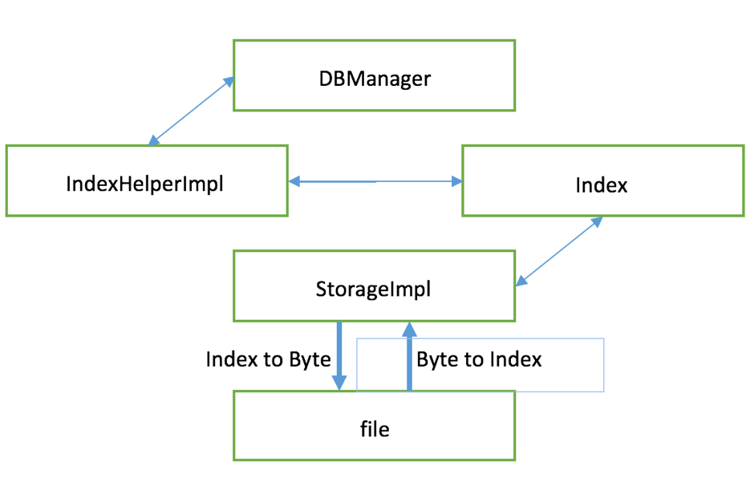

#DataBase internal programming project
###CS542-F15: database management system
--
#Contents		
[**Framework**](#0)				
|------[Main classes](#1)			
|------|------[Storage](#2)		
|------|------[StorageImpl](#3)		
|------|------[Pair](#4)			
|------|------[Index](#5)			
|------|------[IndexHelper](#6)		
|------|------[IndexHelperImpl](#7)				
|------|------[DBManager](#8)			
|------[Operating procedure](#9)	
[Design details](#10)		
|------[metadata structure](#11)			
|------[metadata transformation](#12)		
|------[Physical data storage](#13)		
|------[Fragment](#14)		
|------[Concurrency control](#15)

--
#Framework：
## Main classes
####*Storage*
This is an interface, which contains 2 attributes and 4 method. Storage play a role of write and read data and metadata. By using FileStream, these method can load all the data/metadata, in the form of byte array, into the main memory.  Its two attributes, which are *DATA_SIZE* and *METADATA_SIZE*, are responsible for the constraint of maximum data/metadata size.
#####method:
	void writeData ( String fileName, byte[] data); // write data into file.		
	byte[] readData ( String fileName); // read data from file.		
	void writeMetaData ( String fileName, byte[] metadata); //  write metadata into file.		
	byte[] readMetaData ( String fileName); // read metadata into file.

####*StorageImpl*
The implement of interface Storage. The same method.
####*Pair*
A self-defined class. It is an offset-length pair for some record. *L* and *R* are two integer attributes, which are represented for offset in data and the length of the record, respectively.
####*Index*
*Index* is our main metadata structure in memory. Most of ours work are based on this class. An *Index* class has all the metadata for one single record.
#####Attribute:
	private static final byte sign = -1;
	private static final byte KEYSIZE = Integer.BYTES;
	private static final byte RESERVED=3;
	private int key;
	private List<Pair<Integer, Integer>> indexes;

*sign* is pre-defined as -1, which can be distinguished with any other byte data.		
*KEYSIZE* refers to the size of the key. Since key is *int*, the size is 4 bytes.		
*RESERVED* is reserved for the unexpected usage. Its size 3 bytes.		
*key* is key value of the record.				
*indexes* is a list of Pair class. It can store all the offset-length pairs for single record.		

#####Method:
	void sortpairs();
*sortpairs* makes sure all the pairs within a record will be sorted. It is a bubble sort algorithm.

---
BLABLABLABLABLABLABLA

---

####*IndexHelper*
This is an interface. It includes the methods to manipulate the *Index* class in order to get query and update results.
#####Method:
	List<Pair<Integer,Integer>> findFreeSpaceIndex(int size) ;
	List<Map<Integer,byte[]>> splitDataBasedOnIndex(byte[] data, List<Integer> indexes);
	byte[] indexToBytes(Map<Integer, Index> indexes);
	Map<Integer, Index> bytesToIndex(byte[] metadata);
	Map<Integer, List<Index>> getIndexesBuffer();
	void addIndex(Index index);
	void removeIndex(Integer Key);
---
*findFreeSpaceIndex*		
*splitDataBasedOnIndex*	
*getIndexesBuffer*		
*addIndex*		
*removeIndex*			
BLABLABLA

---
*indextobytes*: Input: indexMap in the memory. Output: byte array for disk storage.		
*bytestoindex*: Input: byte array for disk storage. Output: indexMap in the memory.		

####*IndexHelperImpl*
The implement of interface IndexHelper. The same method.
####*DBManager*

---
#####Attribute:
	private int INDEX_USED = 0;
	private int DATA_USED = 0;
	private static DBManager dbManager = null;
	private byte[] data;
	private Hashtable<Integer, Index> indexes;
#####Method:
BLABLABLABLABLA

---
##Operating procedure
The data/metadata will be stored as byte array. *StorageImpl* class will be responsible for fetch/put the byte array, in which both data and metadata are stored, out of/into the file. IndexHelperImpl will help *DBManager* to transform metadata into what we desire, that is a hash table whose key and value are the key for record and *Index* class, respectively. The more query and update will be executed by the *DBManager* class.

The required functions--put, get and remove--are implemented within the *DBManager*. The *Index* will be modified after these operations. All these execution will happen in the main memory. Before the database is closed, all the *Index* in memory will be transformed back to byte array and then this array will be re-written into the disk.

#Design details
##Metadata structure:
  
#### indexMap:		
This is map structure: *Map\<K, V\>*. This structure will be used in the main memory.
*K* is *Integer*, and *V* is a class of *Index*. indexMap will include the metadata in our database, and more detail will be stored in the class *Index*.
    
1. K represents for the key of a record. K will be an int type number, which is 32-bit or 4 bytes.
2. V is class *Index*. The record will also be treated as the instance of Index class, which has the same attribute key as K. type: int

#### *Index* class:  
This class will contain metadata of a certain record, which key and index pairs.

1. key represents for the key of a record
2. index pairs is a list of class *Pair*. 

#### *Pair* class: 
Pair class,*Pair\<L,R\>*, contains start position(or offset in data array) and length. Typically, one record will have one pair, but when free space are not available in whole multiple indexes are introduced to arrange the data into fragmental space. 	
L is for array offset in data array, and R is for the length of the respective record(or the fragment of that record). Both L and R are int number, which is 4 bytes.

#### byte array:		
Physical metadata storage form. The byte array will be transformed from indexMap when the data need to be stored into disk. Usually, every 16 bytes will be used for recording the metadata for each record, but this size will be varied because of fragment storage. The byte array's structure is shown as followed:
 	
|element|purpose|size|
|---|---|---|
|Start sign|identify record header|1 byte
|reserved bytes|reserved for unexpected situation|3 bytes|
|key|the key of the data|4 bytes
|*Pair* class|stored \<offset,length\> pairs|8*pair number bytes
##Physical/Memory metadata storage & transformation:

### Assumptions & decisions:

1. The start sign is one-byte number, which is -1. There is no other numbers--key, offset or length--to be negative. Any negative indexes are forbidden.
2. Pair list in the class *Index* are sorted. Every times *indextobytes()* are called, the pair list in an index will be sorted by L's value.
3. All the metadata will be converted into byte array. In this case, integer will be convert into 4 byte numbers. In other word, the key, offset and length all will be converted into 4 byte numbers. 
4. There will be a three-byte reserved space for each record. They will be active when it's necessary in the future.

Metadata of each record will be stored one by one all together.

|metadata 1|metadata 2|metadata ...|
|---|---|---|

Each metadata will have structure as followed:

|start_sign (1B)|reserved bytes (3B)|key (4B)|offset 1 (4B)|length 1 (4B)|offset 2 (4B)|length 2 (4B)|...
|---|---|---|---|---|---|---|---|---| 

##Data storage form
### Assumptions & decisions:
1. The data, whichever it is metadata or data itself, will be stored as byte array, which will be accessed by FileStream.

---
BLABLABLABLABLABLABLABLABLABLABLABLABLABLABLA

---
##Fragment 
### Assumptions & decisions:
---
BLABLABLABLABLABLABLABLABLABLABLABLABLABLABLA

---	
##Concurrency control
### Assumptions & decisions:
---
BLABLABLABLABLABLABLABLABLABLABLABLABLABLABLA

---	

